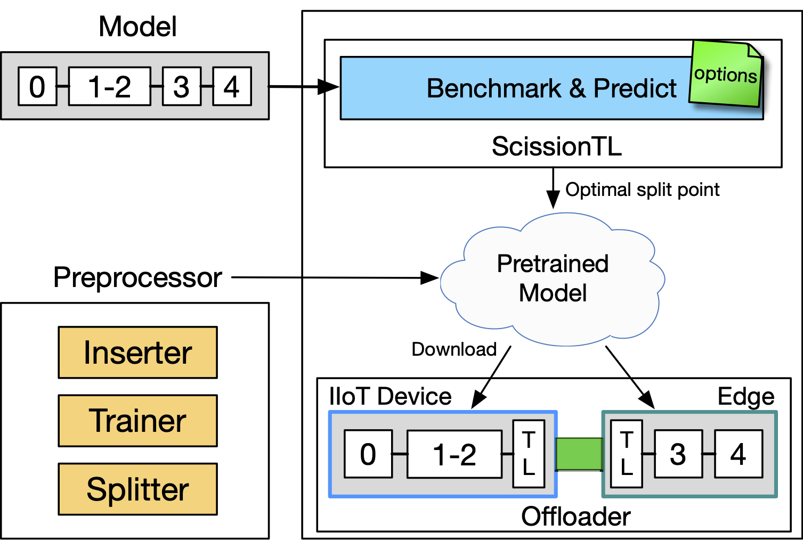
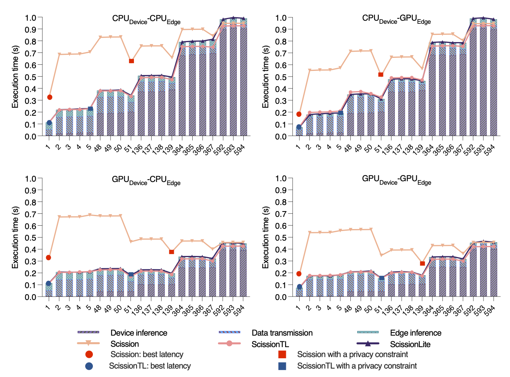

# ScissionTL: A Benchmarking Tool for Accelerating Distributed Deep Neural Networks Using Transfer Layer in Edge Computing

## About the research

You can check original Scission github at here "[github link](https://github.com/qub-blesson/scission#scission-a-tool-for-maximising-performance-of-deep-neural-networks-in-edge-computing)"

ScissionTL is a Scission-based benchmarking tool for distributed deep neural networks (DNNs). Scission automatically benchmarks DNN models on a target set of the device, edge, and cloud resources for deciding the optimal slicing point for maximizing inference performance. Based on Scission, ScissionTL inserts an additional traffic-aware layer called the Transfer Layer (TL) between the split point of the DNN. The TL is a small neural network layer that can reduce the amount of data exchanged during communication. The TL is composed of the DeviceTL and EdgeTL layers respectively for the device and edge resources. The DeviceTL layer compresses the feature maps of the end layer of the sliced DNN on the mobile device. The compressed data is then transferred through the network connection. The EdgeTL layer expands the received data and passes the data to the starting layer of the remaining DNN on the edge. ScissionTL decides the model’s optimal slicing point when the TL is applied. We develop two versions of ScissionTL for the edge side by using TensorFlow and NVIDIA Triton.

### Citing the research

Hyunho Ahn, Munkyu Lee, Cheol-Ho Hong, and Blesson Varghese. "[ScissionLite: Accelerating Distributed Deep Neural Networks Using Transfer Layer](https://arxiv.org/pdf/2105.02019.pdf)", arXiv e-prints (2021): arXiv-2105.

